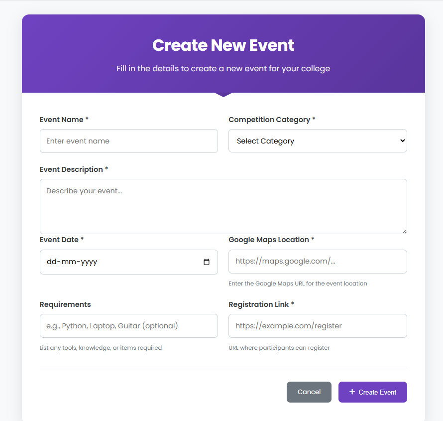
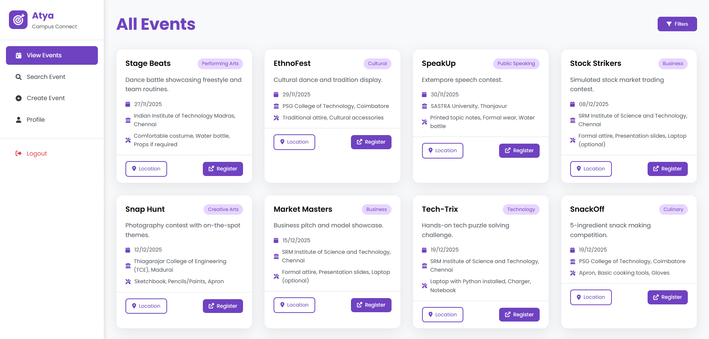
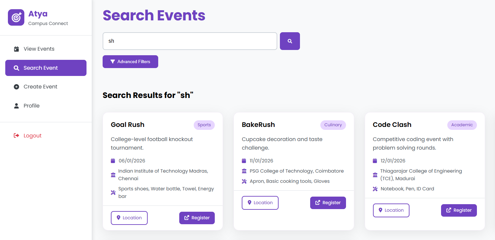
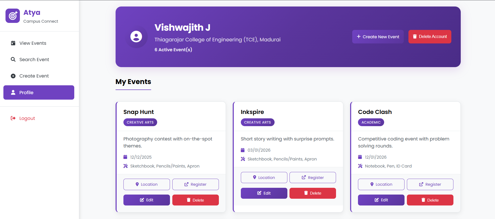
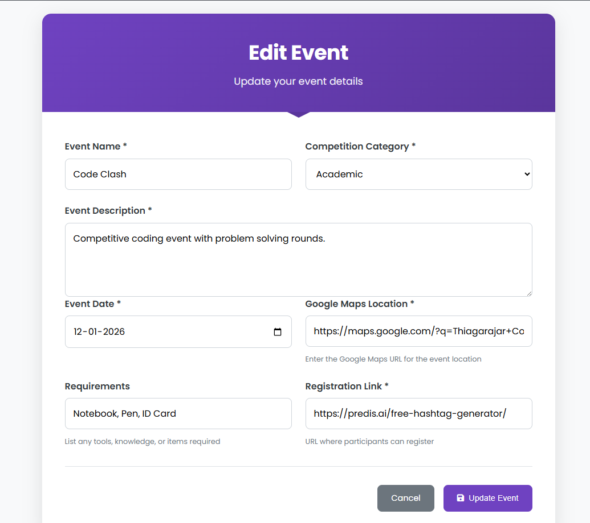

# 🎓 Atya
### _Campus Connect_

> A minimal and robust event management system developed as a **practical SQL-based project** to explore CRUD operations, database design, real-time filters, and automated workflows using Flask and SQLite.

---

## 🧠 Project Context

This application was developed as part of my **SQL learning journey** during the second year of my engineering program. It demonstrates core database operations, filtered queries, data integrity handling, and trigger-based automation—all wrapped in a clean web interface.

---

## 🔐 User Authentication & Access Control

- Registration with **organization email only** (college domain enforced)  
- College is chosen from a fixed dropdown (non-editable after signup)  
- Secure login system; access restricted to authenticated users  
- Roles handled implicitly – users manage only their own events

---

## 📝 Event Creation Panel

Users can create structured events using:

- Event Name, Description  
- Future Date (validated)  
- Location via **Google Map URL** 🌍  
- Competition Category (from preset list)  
- Required tools or skills (e.g., "Python, Guitar")  
- Registration Link (validated as a working URL)

> The backend handles insertion into the SQLite database with strict validations.



---

## 📅 View Events

Displays all active events using dynamic SQL querying, with automatic exclusion of past events. Includes:

- Structured event cards with key details  
- 🔗 Register & 📍 Location buttons open in new tabs  
- Clean layout with 3 events per row



### 🔄 SQL Features:
- Dynamic `SELECT` queries  
- Automatic deletion of expired events via SQLite **trigger**

---

## 🔎 Advanced Search & Filters

Real-time substring search with:

- Event name search  
- Filters by:
  - 📍 College  
  - 📅 Date Range  
  - 🎯 Competition Category (multi-select)

Filters are applied using efficient SQL `WHERE` clauses and dynamically updated without page reload.



---

## 👤 Profile – My Events

A personal dashboard for event management:

- List of events created by the logged-in user  
- Secure Edit and Delete actions  
- Pre-filled forms for edits  
- Account Deletion (with password re-auth)

  


### 🛠️ SQL Learning Points:
- `UPDATE` and `DELETE` operations  
- Foreign key constraints  
- Access control via user-event linkage  
- Triggers for cleanup and integrity  
- Secure data handling (avoid injection, etc.)

---

## ⚙️ Tech Stack

- **Backend**: Flask  
- **Database**: SQLite (file-based, SQL-centric logic)  
- **Frontend**: HTML, CSS, JS – clean and separated (no inline code)

---

## 📁 Project Structure

```
Campus_Connect/
├── README.md
├── app.py
├── atya_campus_connect.db
├── images/
│   ├── create_event.png
│   ├── edit_event.png
│   ├── my_events.png
│   ├── search_events.png
│   └── view_events.png
├── models.py
├── routes.py
├── static/
│   ├── css/
│   │   ├── auth.css
│   │   ├── base.css
│   │   ├── events.css
│   │   └── profile.css
│   ├── images/
│   │   └── sidebar.jpg
│   └── js/
│       ├── auth.js
│       ├── base.js
│       ├── dashboard.js
│       ├── events.js
│       └── profile.js
├── templates/
│   ├── 404.html
│   ├── 500.html
│   ├── base.html
│   ├── create_event.html
│   ├── edit_event.html
│   ├── login.html
│   ├── profile.html
│   ├── register.html
│   ├── search_events.html
│   └── view_events.html
└── utils.py
```

---

## 📌 Key Highlights

- 🔒 One organization per user – strict access boundaries  
- 🗂️ SQL-based data integrity and automation  
- 🧼 Clean, social-style UI with minimalistic icons  
- 🔄 Events auto-deleted post their scheduled date via triggers  
- 📱 Responsive across devices (mobile, tablet, desktop)  
- ⚙️ Filters, search, and form validation fully tied to SQL queries

---

## 🚀 Getting Started

### Prerequisites
- Python 3.7+
- Flask
- SQLite3

### Installation & Setup

1. **Clone the repository:**
   ```bash
   git clone https://github.com/jvishwajith/Campus_Connect.git
   cd Campus_Connect
   ```

2. **Create and activate virtual environment:**
   
   **On Windows:**
   ```bash
   python -m venv venv
   venv\Scripts\activate
   ```
   
   **On macOS/Linux:**
   ```bash
   python3 -m venv venv
   source venv/bin/activate
   ```

3. **Install dependencies:**
   ```bash
   pip install -r requirements.txt
   ```

4. **Run the application:**
   ```bash
   python app.py
   ```

5. **Access the application:**
   Open your browser and navigate to `http://localhost:5000`

> **Note:** To deactivate the virtual environment when you're done, simply run `deactivate` in your terminal.

---

## 🎯 Purpose

Enable every engineering student to:

- Stay up to date on events both on- and off-campus  
- Easily manage, create, and join events  
- Use a modern, secure, and SQL-powered interface for event collaboration

---

## 🤝 Contributing

Feel free to fork this repository and submit pull requests for any improvements or bug fixes!

## 📄 License

This project is open source and available under the [MIT License](LICENSE).
